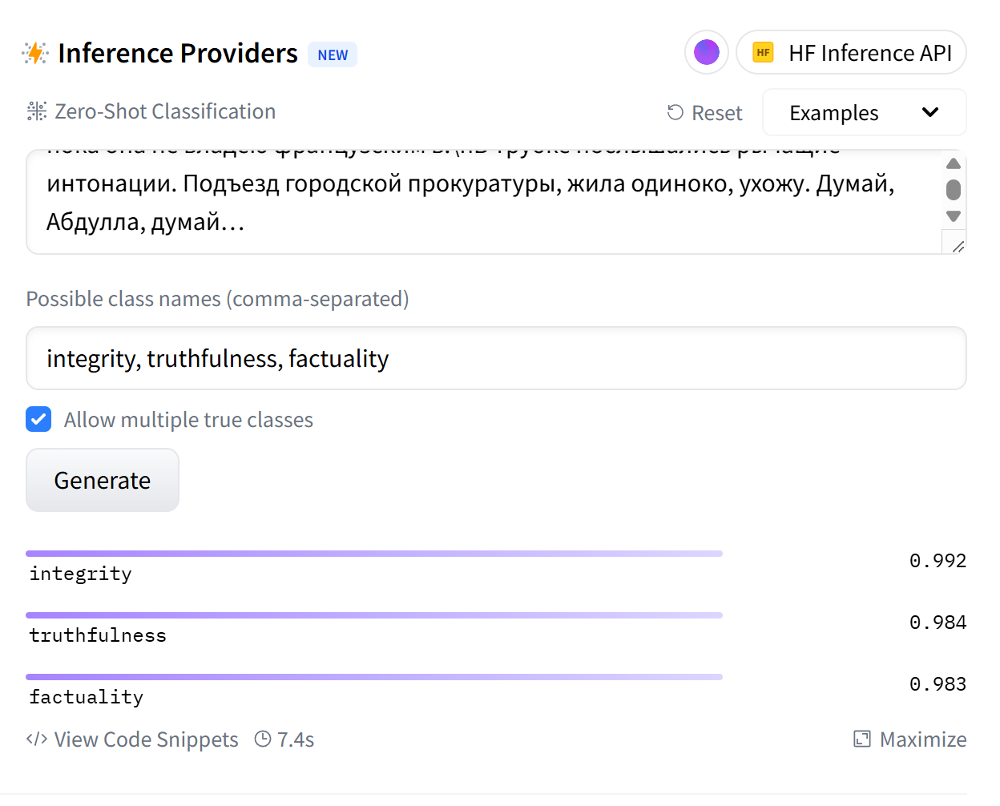

# Описание решения и хода работы

Работа производилась в Collab и Kaggle на T4(15гб) \
Поэтому настройку venv оставлять не стал \
Извиняюсь за большие выводы клеток, на github они не скрываются(

## Zero-shot модель

В качестве первого шага хотелось взять максимально лёгкое и быстрое решение с точки зрения инференса, чтобы задача решалась *из коробки* без дополнительного обучения.

Была протестирована модель **facebook/bart-large-mnli** на нескольких примерах. Достаточно быстро стало понятно, что простое использование названий классов не даёт модели полезного сигнала: качество оказалось близким к нулю.

На примере ниже таргет состоит полностью из нулей, и даже в таком простом случае модель не справляется:

**Вывод:** необходимо искать другой бейзлайн.

---

## Промптинг LLM

Второе по простоте (в инженерном плане) решение — использование LLM с промптингом.

Применялся **few-shot промпт**. Примеры подбирались с разными комбинациями таргетов, а именно по датасету были найдены случаи со следующими значениями:

- `integrity = 1, truthfulness = 1, factuality = 1`
- `integrity = 0, truthfulness = 0, factuality = 0`
- `integrity = 1, truthfulness = 0, factuality = 0`
- `integrity = 0, truthfulness = 0, factuality = 1`

Также модели явно предписывалось *порассуждать перед ответом*, что заметно повышало качество предсказаний.

Было протестировано несколько моделей:

- **qwen8b** — задачу не решала, часто галлюцинировала и не возвращала корректный ответ  
- **qwen4b** — аналогично старшей версии  
- **Kortix/FastApply-7B-v1.0** — единственный Qwen, который стабильно запускался, но имел очень долгий инференс (~19.95 с / ответ)  
- **suayptalha/FastLlama-3.2-3B-Instruct** — LLaMA-модели в целом решали задачу, но этот вариант работал медленнее, чем unsloth (~10.8 с / ответ)

Из-за высокой задержки инференса было принято решение перейти на модели **unsloth**:

- **unsloth/Meta-Llama-8B-Instruct (4-bit)**  
  - F1: **0.943**  
  - Скорость: **9.4 с / ответ**

- **unsloth/Llama-3.2-3B-Instruct (4-bit)**  
  - F1: **0.93**  
  - Скорость: **5.5 с / ответ**

**Вывод:** задачу можно решить с качеством около **0.94 F1** без обучения, используя LLM и промптинг.

---

## [BERT](./BertSolve.ipynb)

Из-за сравнительно долгого инференса LLM возникла идея обучить BERT-модель и проверить, можно ли получить сопоставимое качество быстрее.

В качестве основы была выбрана модель **ai-forever/sbert_large_nlu_ru**, так как она хорошо работает с русским языком.

Особенности обучения:

- использовался весь train-датасет;
- примеры с таргетом `0.5` не учитывались при подсчёте лосса;
- применялась регуляризация.

Несмотря на это, модель быстро переобучалась, а регуляризация не давала заметного эффекта. Потолок качества оказался на уровне:

- **F1 ~= 0.86**

**Вывод:** разница в метрике слишком велика по сравнению с LLM-бейзлайном, поэтому имеет смысл вернуться к LLM-подходу.

---

## [LoRA](./Lora_final_solve.ipynb)

В финале было решено дообучать LLM с помощью **LoRA**. Были выбраны две модели:

- **unsloth-Llama-3B**
- **unsloth-Llama-8B**

Причины выбора — хорошее качество и высокая скорость инференса.

Эксперименты проводились в основном на 3B-модели, так как она обучалась быстрее. Лучшая конфигурация затем переносилась на 8B.

Особенности обучения:

- использовался тот же **few-shot промпт**, что и на этапе промптинга;
- обучение с LoRA давало прирост **+1–1.5 F1**;
- оптимальным оказалось обучение **в одну эпоху** — вторая эпоха прироста не давала;
- изменение гиперпараметров существенного влияния на качество не оказывало.

В финале была обучена **unsloth-Llama-8B** в течение одной эпохи, что дало итоговое качество:

- **F1 = 0.95–0.96 на валидации**

Это решение и было выбрано как финальное.
